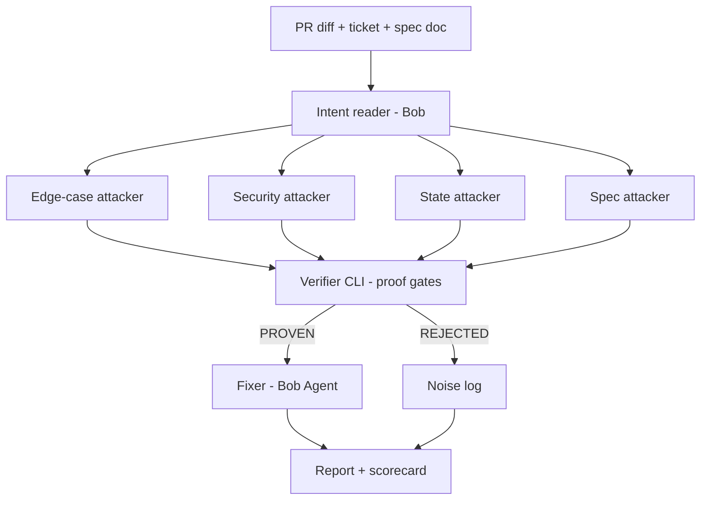

# Crucible PRD — IBM Bob 2.0 Hackathon

Sep 26, 2026 · @Akhil

## Overview and problem

Crucible is a code-review agent built on IBM Bob 2.0 that only reports a bug when it can prove it with a failing test, then fixes it. The workflow it improves is pull-request review.

**The problem.** AI reviewers produce many comments per PR, and a large share are wrong, vague or style nitpicks. Developers stop reading them, so real bugs still reach main. Human reviewers then spend time debating whether a flagged issue is real.

**The fix.** Parallel Bob subagents attack a PR from different angles. Each suspicion must become a runnable test that fails on the PR. A deterministic verifier throws out anything it cannot reproduce. Bob Agent then patches the code until every proof test passes.

| Today | With Crucible |
| --- | --- |
| Reviewer says "this might break on empty input" | Crucible attaches a test that breaks it, and the fix |
| High comment volume, low trust | Few comments, each backed by a red-then-green test |
| Proof tests thrown away after review | Proof tests stay in the repo as regression tests |

**Primary user:** a developer or reviewer on a team that merges PRs daily. **Demo target:** a small Python FastAPI service with pytest.

## Hackathon alignment

Crucible targets the code review workflow and covers every requirement in the IBM Bob 2.0 challenge statement.

| Challenge requirement | How Crucible meets it | Evidence for judges |
| --- | --- | --- |
| Improve a specific developer workflow | Pull-request code review | README problem statement |
| Define where time, effort or errors are too high | Noisy AI comments, missed bugs, review debates | Baseline run of a plain AI review on the same PRs |
| Working prototype on a real or sample project | Sample FastAPI repo with 3 PRs | Public GitHub repo + demo video |
| Agent mode | Fixer loop patches code until proofs pass | Bob session report |
| Parallel tasks | 4 attacker lenses run at the same time | Bob session report, timing log |
| Subagents | One subagent per attack lens, plus fixer | Bob session report |
| Document understanding | Reads the ticket and spec doc to find intent violations | spec/ folder + finding citing the spec line |
| Manage multiple steps, not just coding | Intent → attack → verify → fix → report | Pipeline diagram + report |
| Demonstrate impact | Precision of comments, bugs proven, time to review | Scorecard in report and video |

Mandatory: Bob IDE is the core tool, and every team member exports Bob task session reports into the repo.

## Council verdict summary

The council's main call: the verifier, not the attackers, is the product, so build it first and make it strict.

| Advisor | Key point | Decision taken |
| --- | --- | --- |
| Contrarian | An attacker can "prove" a bug with a wrong test that asserts the wrong behaviour | Every proof must cite a spec line or a universal property (no crash, no 500, no data loss) |
| First Principles | The real value is trust in review comments, so the core metric is precision | Headline metric: proven findings ÷ raw suspicions |
| Expansionist | Proof tests become a permanent regression suite | Accepted tests are committed to tests/crucible/ |
| Outsider | "Proof-carrying" is jargon; judges need to see red then green | Demo shows the failing test, then the fix, then green |
| Executor | \~20 hours left; GitHub App and multi-language won't fit | One language, CLI + static report, no GitHub App |

**Caught in peer review:** flaky tests could create fake proofs, so each proof must fail 3 of 3 runs. The baseline comparison must be run honestly on the same PRs, and planted bugs must be disclosed in the demo.

## Goals, non-goals and success metrics

The goal is a working end-to-end run on 3 PRs that shows every reported bug is real and fixed.

**Goals**

- Turn AI review suspicions into proven, reproducible findings
- Auto-fix every proven finding and keep the proof test as a regression test
- Show a measurable gain over a plain AI review on the same PRs

**Non-goals (for the hackathon)**

- GitHub App or CI integration
- Languages other than Python
- Style, naming or formatting comments
- Legal claims that the code is "bug-free"

**Success metrics**

| Metric | Definition | Target on demo PRs |
| --- | --- | --- |
| Precision | Proven findings ÷ findings reported | 100% (by design) |
| Noise removed | Raw suspicions rejected by the verifier | Show the real count |
| Recall on planted bugs | Planted bugs caught ÷ planted bugs | ≥ 5 of 6 |
| Fix rate | Proven findings fixed with all tests green | ≥ 80% |
| Time to reviewed PR | Wall-clock from PR to report | Under 10 minutes per PR |

Open question: record the plain-AI baseline comment count during the build so the comparison uses real numbers.

## Features

Build all P0 features first; P1 only after a full P0 run works end to end.

| Priority | Feature | What it does | Built with |
| --- | --- | --- | --- |
| P0 | Intent reader | Reads PR diff, ticket and spec doc; writes intent.json listing expected behaviours with spec line refs | Bob (doc understanding) |
| P0 | 4 attacker lenses | Edge cases, security, concurrency/state, spec violations; each writes candidate tests + a one-line claim | Bob subagents, parallel |
| P0 | Verifier | Runs every candidate test through the proof gates; outputs PROVEN or REJECTED with a reason | Python CLI (deterministic) |
| P0 | Fixer loop | Patches code for each proven finding, reruns full suite, max 3 attempts | Bob Agent mode |
| P0 | Report | Markdown + HTML report: findings, proof test, fix diff, scorecard | Python CLI |
| P1 | Baseline comparison | Runs a plain one-shot AI review on the same PR and counts comments vs proven findings | Bob Ask mode |
| P1 | Dashboard | Single HTML page: scorecard, per-PR findings, rejected-noise list | Claude Code |
| P1 | Regression capture | Commits accepted proof tests to tests/crucible/ | Python CLI |
| P2 | Mutation check | Confirms each proof test fails when its fix is reverted | Python CLI |
| P2 | Bob Shell headless run | Runs the pipeline from the terminal for CI use | Bob Shell |

Out of scope: GitHub App, multi-language support, style comments.

## Architecture

Crucible splits into two halves: Bob does the thinking (intent, attacks, fixes) and a deterministic Python CLI does the judging (verify, score, report). The AI never grades its own work.



**Components**

| Component | Role | Tech |
| --- | --- | --- |
| Crucible playbook | Instructions Bob follows for each stage and lens | Markdown rules/mode files in .bob/ (confirm exact path in Bob docs) |
| Intent reader | Produces intent.json from docs + diff | Bob |
| Attackers | Write candidate tests + findings.json entries | Bob subagents |
| crucible verify | Runs proof gates, writes verdicts.json | Python 3.11, pytest, git worktree |
| Fixer | Patches code per proven finding | Bob Agent |
| crucible report | Builds report.md + report.html | Python, Jinja2 |

**Repo structure**

```text
crucible/
  .bob/                 # playbook: intent, 4 attacker lenses, fixer
  crucible/             # CLI: verify.py, gates.py, report.py
  demo-app/             # FastAPI service under review + tests/
  demo-app/spec/        # ticket + spec docs Bob reads
  runs/<pr-id>/         # intent.json, findings.json, verdicts.json, report
  bob-sessions/         # exported Bob task session reports (mandatory)
  README.md
```

**Finding record (findings.json)**

```json
{
  "id": "F-003",
  "lens": "spec",
  "claim": "Refund allowed after 30 days, spec says 14",
  "basis": "spec/refunds.md#L12",
  "test_path": "tests/crucible/test_f003.py",
  "verdict": "PROVEN",
  "gate_results": {"fails_on_pr": true, "passes_on_base": true, "repro": "3/3", "grounded": true},
  "fix_commit": "a1b2c3d"
}
```

## Proof gates and verdict model

A finding is PROVEN only if it passes all four gates; failing any gate makes it REJECTED with the gate named as the reason.

| Gate | Check | Why it exists |
| --- | --- | --- |
| 1. Fails on PR | Test fails on the PR branch with an assertion error, not an import or syntax error | A broken test is not a bug |
| 2. Blame check | Test passes on the base branch, or targets code that is new in the PR | Proves the PR caused it, not old code |
| 3. Reproducible | Fails 3 of 3 runs, fresh process each time | Filters flaky or timing-based noise |
| 4. Grounded | Claim cites a spec/ticket line, or a universal property: no unhandled exception, no 5xx, no data loss or leak | Stops attackers asserting made-up behaviour |

**Verdicts**

| Verdict | Meaning | Shown to reviewer |
| --- | --- | --- |
| PROVEN | All 4 gates passed | Yes, with test and fix |
| REJECTED | A gate failed | Only in the noise log |
| UNFIXED | Proven, but fixer failed after 3 attempts | Yes, flagged for a human |

Gate 4 is checked two ways: the verifier confirms the cited spec line exists, and Bob's intent.json must list that behaviour. A human-readable reason is stored for every rejection.

## IBM Bob feature mapping

Every stage except verification runs inside Bob IDE, so the session reports show Bob doing the core work.

| Stage | Bob feature | Input | Output |
| --- | --- | --- | --- |
| Understand repo | Ask mode, full-repo context | demo-app/ | Short architecture note |
| Read intent | Document understanding | PR diff, spec/\*.md, ticket | intent.json |
| Plan attacks | Plan mode | intent.json | Attack plan per lens |
| Attack | Subagents + parallel tasks | Plan, diff | Candidate tests + findings.json |
| Run verifier | Agent mode calling the CLI | findings.json | verdicts.json |
| Fix | Agent mode | PROVEN findings | Patches, all tests green |
| Baseline | Ask mode | PR diff only | Plain review comments to compare |
| Build Crucible itself | Agent mode | This PRD | CLI, playbook, sample app |

Claude Code may help with the dashboard HTML and styling only. Keep the attack, verify and fix runs in Bob so they appear in the exported reports.

## Build pipeline

The build takes about 20 hours in six phases, each with a gate that must pass before moving on. Submission closes Sep 27, 15:00 UTC (20:30 IST); aim to finish by 13:00 UTC.

| Phase | Hours | Tasks | Tool | Gate to move on |
| --- | --- | --- | --- | --- |
| 0. Setup | 0–1 | Repo skeleton, Bob IDE signed in, start session export habit, README stub | Bob | First Bob session exported to bob-sessions/ |
| 1. Sample app | 1–4 | FastAPI "orders and refunds" service, 15 passing tests, spec/refunds.md + ticket; 3 PRs with 2 planted bugs each (1 edge case, 1 spec violation per PR) | Bob Agent | Base branch green, 3 PR branches exist |
| 2. Verifier | 4–8 | crucible verify: git worktrees for base and PR, pytest runner, 4 gates, verdicts.json | Bob Agent | Hand-written real and fake findings sorted correctly |
| 3. Attack + intent | 8–12 | Playbook: intent reader, 4 lens prompts, findings.json format; run on PR 1 | Bob subagents | PR 1 produces ≥ 1 PROVEN and ≥ 1 REJECTED |
| 4. Fix + report | 12–15 | Fixer loop (max 3 tries), report.md and report.html, scorecard | Bob Agent | PR 1 fully green with report |
| 5. Full runs | 15–17 | Run PRs 2 and 3, baseline review on all 3, record timings | Bob | Real numbers for every metric |
| 6. Ship | 17–20 | Dashboard polish, README, slides, 3-min video, export all sessions, submit | Claude Code + Bob | Submitted with repo, video, sessions |

**Cut list if behind schedule** (drop in this order): dashboard polish, PR 3, baseline comparison, mutation check. Never cut the verifier or the Bob session exports.

**Task checklist**

- [ ] Register and join Bob IDE
- [ ] Sample app + 3 planted-bug PRs
- [ ] crucible verify with 4 gates
- [ ] Playbook: intent + 4 lenses + fixer
- [ ] Full run on all PRs
- [ ] Report + scorecard
- [ ] Bob sessions exported (every member)
- [ ] README, video, slides, submit

## Demo script and submission checklist

The 3-minute video follows one PR from noisy review to proven, fixed bugs.

| Time | Show | Say |
| --- | --- | --- |
| 0:00–0:20 | Plain AI review with many comments | "Most of these are noise, so developers ignore them." |
| 0:20–0:45 | Bob reading the spec and diff, then 4 attackers starting at once | "Crucible attacks the PR, but only proof counts." |
| 0:45–1:30 | Verifier output: PROVEN vs REJECTED with reasons | "A suspicion becomes a finding only if its test fails." |
| 1:30–2:15 | One spec bug: red test, Bob fix, green | "Every comment ships with its proof and its fix." |
| 2:15–2:45 | Scorecard across 3 PRs vs baseline | Real numbers from phase 5 |
| 2:45–3:00 | Repo, session reports | "Bugs were planted in a sample app for this demo." |

**Submission checklist**

- [ ] Public GitHub repo with README: problem, solution, architecture, how Bob was used, setup
- [ ] bob-sessions/ with exported reports from every member
- [ ] Video under 3 minutes
- [ ] Slide deck (8–10 slides)
- [ ] Short and long descriptions on lablab
- [ ] Cover image

**Short description:** AI code reviewers leave lots of comments that turn out to be wrong, so developers stop reading them. Crucible sends parallel IBM Bob subagents to try to break a pull request, and a bug only gets reported if a test proves it. Bob then fixes the code until the tests pass.

## Risks and mitigations

The biggest risk is running out of time, so the verifier and session exports come first and everything else is cuttable.

| Risk | Impact | Mitigation |
| --- | --- | --- |
| Time runs out | No submission | Gates per phase, cut list, finish by 13:00 UTC |
| Attackers write wrong tests that still fail | Fake proofs | Gate 4 grounding + blame check |
| Flaky tests | Fake proofs | 3 of 3 reproduction rule |
| Bob can't run true parallel subagents as planned | Weaker feature story | Run lenses as separate Bob tasks and log timing; say so honestly |
| Bob usage limits hit mid-build | Stalled pipeline | Save intermediate JSON after each stage so runs can resume |
| Missing session reports | Disqualification | Export after every major task, not at the end |
| Judges think bugs are too easy | Lower innovation score | Include one subtle spec bug that plain review misses |
| Heavy Claude Code use hides Bob's role | Low Bob-usage score | Keep core pipeline in Bob; Claude Code only for UI polish |
