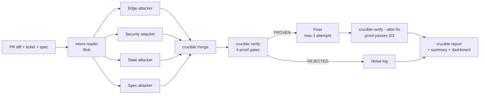

# Crucible

**A code reviewer that only reports a bug when a failing test proves it, then fixes it.**
Built for the IBM Bob 2.0 Hackathon.

## 1. Problem

AI code reviewers leave a lot of comments on every pull request, and many of them are wrong, vague or
style nitpicks. Developers learn to ignore them, so real bugs still reach `main`, and human reviewers
spend time arguing about whether a flagged issue is even real.

## 2. Solution

Crucible attacks a pull request instead of commenting on it. Four attacker agents, each with a
different lens, run in parallel and try to break the PR. Every suspicion must become a pytest test
that **fails on the PR**. A deterministic Python verifier throws away anything it cannot prove. A
fixer then patches the code until every proof test passes, and the proof tests stay in the repo as
regression tests.

The AI does the thinking (intent, attacks, fixes). The Python CLI does the judging (verify, score,
report). **The AI never grades its own work.**

| Today | With Crucible |
|---|---|
| "This might break on empty input" | A test that breaks it, plus the fix |
| Many comments, low trust | Few findings, each with a red-then-green test |
| Review comments are thrown away | Proof tests stay as regression tests |

## 3. How it works



| Stage | Input | Output |
|---|---|---|
| Intent | `git diff main...<pr>`, ticket, `spec/orders.md` | `runs/<pr>/intent.json` (rules the PR must obey) |
| Attack (4 lenses in parallel) | playbook + intent | `runs/<pr>/tests/test_<lens>_<n>.py`, `findings/<lens>.json` |
| Merge | per-lens findings | `findings.json` (F-001…), `timing.json` |
| Verify | findings, git worktrees for PR and base | `verdicts.json` |
| Fix | PROVEN findings | one `fix(<id>)` commit per root cause on the PR branch |
| Verify after fix | fixed PR branch | `after_fix` per finding, `fix_check.json` |
| Report | all of the above | `report.md`, `report.html` |

The playbook every agent follows lives in [`.bob/playbook/`](.bob/playbook/): `intent.md`,
`attack-common.md`, four lens files and `fixer.md`. The lens files contain no PR-specific hints and
were not changed between PRs.

## 4. Proof gates

A finding is **PROVEN** only if it passes all four gates. Otherwise it is **REJECTED** with the gate
named as the reason.

| Gate | Check | Rejection reason |
|---|---|---|
| G1 Fails on PR | JUnit shows an assertion `<failure>`. An `<error>`, or a failure caused by any non-assertion exception, means the test is broken | `test broken` / `does not fail on PR` |
| G2 Blame | Passes on base, or fails on base but calls a route or name added in `git diff main...<pr> -- demo-app/app` | `pre-existing behaviour` |
| G3 Reproducible | Fails 3 of 3 runs, each in a fresh subprocess | `flaky` |
| G4 Grounded | `basis` is a rule that exists in `spec/orders.md` **and** is listed in the run's `intent.json`, or a universal property (`no_5xx`, `no_unhandled_exception`, `no_data_leak`, `no_negative_money`, `no_double_effect`) | `ungrounded` |

After fixing, `verify --after-fix` re-runs every proof test 3 times on the fixed branch. A proven
finding whose test does not pass 3/3 is marked **UNFIXED** and flagged for a human.

The verifier was checked against a hand-written self-test ([`runs/verifier-selftest/`](runs/verifier-selftest/)):
one real bug and three fakes (wrong expectation, broken test, pre-existing behaviour). Result: exactly
1 PROVEN and 3 REJECTED, each with the correct reason.

## 5. How IBM Bob was used

| Stage | Bob feature | Session report |
|---|---|---|
| Sample app, spec, tickets, 3 PR branches with planted bugs | Agent mode | `bob-sessions/phase1-sample-app.md` |
| Verifier plan → implementation → self-test | Plan + Agent mode | `bob-sessions/phase2-verifier.md` |
| Playbook (intent, 4 lenses, fixer) and PR-1 intent | Agent mode, document understanding | `bob-sessions/phase3-playbook.md` |
| PR-1 attack: 4 lenses at once | Subagents, parallel tasks | `bob-sessions/phase3-attack.md` |
| PR-2 and PR-3 intent + attack | Document understanding, subagents, parallel tasks | `bob-sessions/phase5-attack.md` |
| Plain-AI baseline review | Ask mode | `bob-sessions/phase5-baseline.md` |

**What was not done in Bob.** The team ran low on Bob credits, so Claude Code did the following:
- **Reviews:** reviewed Bob's code at each gate.
- **Tooling:** built `verify --after-fix`, `crucible merge`, `crucible report`, `crucible summary` and the dashboard.
- **Fixer runs:** executed the fixer playbook on all three PRs. Each fix stage's `by` field in `timing.json` records this.

The attacks and intent extraction were all done by Bob. Every verdict comes from the deterministic CLI.

## 6. Results

From [`runs/summary.md`](runs/summary.md). Every number is generated from files in `runs/`.

| Metric | PR-1 refunds | PR-2 discounts | PR-3 bulk cancel | Total |
|---|---|---|---|---|
| Raw suspicions from attackers | 20 | 20 | 20 | 60 |
| Proven (failing test, all 4 gates) | 2 | 4 | 10 | 16 |
| Rejected as noise | 18 | 16 | 10 | 44 |
| Distinct fixes (root causes fixed) | 1 | 2 | 3 | 6 |
| Fixed (proof passes 3/3 after fix) | 2 | 4 | 7 | 13 |
| Unfixed, flagged for a human | 0 | 0 | 3 | 3 |
| Precision of reported findings | 100% | 100% | 100% | 100% |
| Suspicions confirmed | 10% | 20% | 50% | 26.7% |
| Fix rate | 100% | 100% | 70% | 81.2% |
| Pipeline time (seconds) | 95 | 297 | 175 | 567 |

- **Precision** is proven findings ÷ findings reported to the reviewer. It is 100% by design, because only proven findings are reported.
- **Suspicions confirmed** is proven ÷ raw attacker suspicions. The other 44 were noise that a plain reviewer would have posted as comments, and the verifier filtered them out.
- **All four attacks ran in parallel.** The four lens time windows overlap for every PR (`timing.json`).
- **After the fixes, each PR branch passes its full test suite** as committed: 31, 33 and 35 tests.
- **PR-3's 3 unfixed findings are a real spec ambiguity, not a failure.** F-009 cites R8 and requires 403 for another user's order. F-011, F-012 and F-015 require 200 with that order skipped. The two sets of tests send the same request, so no code can satisfy both. Crucible fixed the R8 behaviour and flagged the conflicting proofs for a human decision.
- **Baseline comparison:** the plain-AI review numbers are in `runs/summary.md` once `runs/<pr>/baseline.md` is recorded.
- **Recall:** recall on the planted bugs is computed by the team against the private list and reported in the demo video.

Open the dashboard at [`dashboard/index.html`](dashboard/index.html), or a single PR report such as
[`runs/pr-3-bulk-cancel/report.html`](runs/pr-3-bulk-cancel/report.html).

## 7. Quick start

```bash
python3 -m venv .venv && .venv/bin/pip install -e .      # Python 3.11+
.venv/bin/python -m pytest -q                      # verifier unit tests + demo-app tests

# Verifier self-test: expect 1 PROVEN, 3 REJECTED.
# The pr-* branches now contain Crucible's fixes; the *-original tags are the PRs as submitted.
.venv/bin/python -m crucible.cli verify --pr pr-1-refunds-original --base main --run-dir runs/verifier-selftest

# Pipeline for one PR (attack output in runs/<pr>/findings/ and runs/<pr>/tests/)
.venv/bin/python -m crucible.cli merge  --run-dir runs/pr-2-discounts
.venv/bin/python -m crucible.cli verify --pr pr-2-discounts --base main --run-dir runs/pr-2-discounts
#   ...fixer follows .bob/playbook/fixer.md...
.venv/bin/python -m crucible.cli verify --pr pr-2-discounts --run-dir runs/pr-2-discounts --after-fix
.venv/bin/python -m crucible.cli report --run-dir runs/pr-2-discounts

# Cross-PR summary and dashboard
.venv/bin/python -m crucible.cli summary
.venv/bin/python scripts/build_dashboard.py
```

### Web app: check a pull request in the browser

```bash
.venv/bin/python -m crucible.cli serve       # open http://127.0.0.1:8765
```

1. **Upload** a git repository as a `.zip` (including its `.git` folder), pick a folder, or give a path on this machine.
2. **Choose** the base branch, the PR branch and IBM Bob's attacker output (`runs/<pr>/findings/`).
3. **Run proof gates.** Crucible runs every test through G1–G4 and shows the proven findings, the rejected noise, a live log and the full report.

Try it on this repo: load it by path, then choose `main`, `pr-2-discounts-original` and `runs/pr-2-discounts`.
You should get 4 proven and 16 rejected.

This mode is verify-only. The attack tests come from IBM Bob following `.bob/playbook/`, and the web app
never calls an AI. It runs the repo's tests on your machine and only listens on 127.0.0.1. A project
that is not laid out like `demo-app/` can describe its layout in a `crucible.toml`
(see `crucible/layout.py`).

## 8. Limitations

- **Scope:** Python and pytest only. Demonstrated on a small FastAPI sample app, with **bugs planted
  on purpose** in three PR branches.
- **Not every catch was blind.** The PR-1 `created_at` bug is named in the build instructions and the
  verifier self-test, which live in the same workspace. Proof F-016 on PR-1 is almost identical to
  the self-test, so it does not count as a blind catch.
- **Grounding checks existence, not relevance.** G4 confirms that the cited rule exists and is in
  `intent.json`, but not that the rule actually states the tested behaviour. For example, PR-2's
  F-012 and F-013 cite R21 for a "placed orders only" rule that comes from the ticket.
- **Some tests over-assert.** Attackers sometimes add precondition asserts beyond their claim. That
  is how PR-3's F-011, F-012 and F-015 came to conflict with F-009.
- **Parallelism:** Bob subagents were launched in the same turn. Overlapping start and end
  timestamps are the evidence that they ran in parallel.
- **Timing:** stage timings measure execution only, not human or agent think time between stages.
  PR-1's verify time was recorded by Bob and includes its tool overhead. Later stages were timed by
  the CLI itself.

## 9. Future work

- GitHub App that posts only proven findings, each with its proof test and fix, as a PR review
- Headless CI run via Bob Shell
- More languages and test runners
- Mutation check: confirm each proof test fails again when its fix is reverted
- Semantic grounding: check that the cited rule actually states the asserted behaviour
